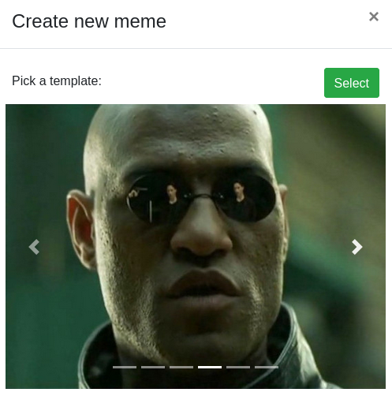
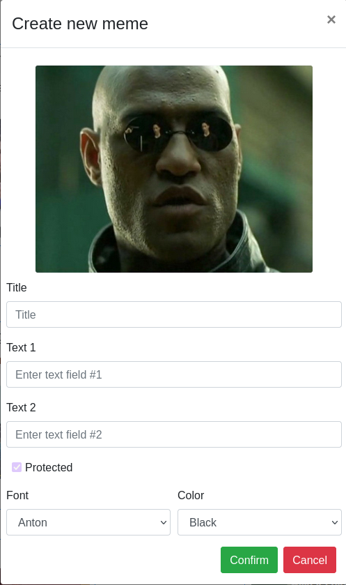

# Meme Generator

## React Client Application Routes

- Route `/`: home page
- Route `/PageNotFound`: page not found, every non valide route will be redirected here
- Route `/login`: login page
- Route default : redirect to /PageNotFound 

## API Server

### Authentication Management
- POST `/api/sessions`
  - Description: login user
  - Request body: credentials of the user who is trying to login
    ``` JSON
    {
        "username": "elon.musk@polito.it",
        "password": "tesla3"
    }
    ```
  - Response: `200 OK` (success), `401 Unauthorized User` (login failed), `500 Internal Server Error` (generic error)
  - Response body: authenticated user
    ``` JSON
    {
      "id": 1,
      "username": "elon.musk@polito.it",
      "name": "Elon"
    }
    ```

- DELETE `/api/sessions/current`
  - Description: logout current user
  - Request body: _None_
  - Response: `200 OK` (success), `401 Unauthorized User` (user not logged in), `500 Internal Server Error` (generic error),
  - Response body: _None_

- GET `/api/sessions/current`
  - Description: check if current user is logged in and get data
  - Request body: _None_
  - Response: `200 OK` (success), `401 Unauthorized User` (user not logged in), `500 Internal Server Error` (generic error)
  - Response body: authenticated user
    ``` JSON
    {
      "id": 1,
      "email": "elon.musk@polito.it",
      "name": "Elon"
    }
    ```

### Memes Management
- GET `/api/memes/all`
  - Description: retrieve all memes from all users (public and protected)
  - Request body: _None_
  - Response: `200 OK` (success), `401 Unauthorized User` (login failed), `500 Internal Server Error` (generic error)
  - Response body: list of memes
    ``` JSON
    [
      {
        "id": 2,
        "templateId": 1,
        "userId": 1,
        "title": "Making Memes",
        "protected": 0,
        "font": "capriola",
        "color": "black",
        "text1": "Is making memes all day all you ever do?",
        "text2": "",
        "text3": "",
        "name": "Elon"
      },
    ]
    ```

- GET `/api/memes/public`
  - Description: retrieve all public memes from all users
  - Request body: _None_
  - Response: `200 OK` (success), `500 Internal Server Error` (generic error)
  - Response body: list of public memes
    ``` JSON
    [
      {
        "id": 2,
        "templateId": 1,
        "userId": 1,
        "title": "Making Memes",
        "protected": 0,
        "font": "capriola",
        "color": "black",
        "text1": "Is making memes all day all you ever do?",
        "text2": "",
        "text3": "",
        "name": "Elon"
      },
    ]
    ```

- POST `/api/meme/create`
  - Description: add a new meme to the logged user's memes
  - Request body: new meme created
    ``` JSON
    {
      "templateId": 0,
      "title": "PDS",
      "protected": 1,
      "font": "arial",
      "color": "black",
      "vetText": ["When you pass System Programming at the first call", "", ""]
    }
    ```
  - Response: `200 OK` (success), `401 Unauthorized User` (login failed), `500 Internal Server Error` (generic error), `400 Bad Request` (validation failed)
  - Response body: _None_

- POST `/api/meme/copy/:id`
  - Description: copy a meme with updated values and add to logged user's memes (check visibility restrictions)
  - Request body: new meme created by copy
    ``` JSON
    {
      "userId": 2,
      "templateId": 0,
      "title": "PDS",
      "protected": 1,
      "font": "arial",
      "color": "black",
      "vetText": ["When you pass System Programming at the first call", "", ""]
    }
    ```
  - Parameters: id of the orginal meme being copied
  - Response: `200 OK` (success), `401 Unauthorized User` (login failed), `403 Forbidden` (copying a protected meme of another user), `500 Internal Server Error` (generic error), `400 Bad Request` (validation failed)
  - Response body: _None_

- DELETE `/api/meme/:id`
  - Description: delete a meme of the logged user
  - Request body: _None_
  - Parameters: id of the meme
  - Response: `200 OK` (success), `401 Unauthorized User` (login failed), `500 Internal Server Error` (generic error), `400 Bad Request` (parameter id not numeric)
  - Response body: _None_

## Database Tables

- Table `users`:
  - It stores all informations of the registered users
  - contains: *id*, *email*, *name*, *hash*
- Table `memes` 
  - It stores all memes of the registered users, with a unique identifier (*id*). The memes contains all meme's **variable** informations, with respect to the specific template (defined by *templateId*)
  - contains: *id*, *templateId*, *userId*, *title*, *protected*, *font*, *color*, *text1*, *text2*, *text3*

## Main React Components

- `XLogin` (in `XLogin/XLogin.js`): login page, allows authentication
- `XNavbar` (in `XNavbar/XNavbar.js`): navbar on home page. It has site logo, a search bar to filter memes based on title and login/logout menu dropdown
- `XCardGrid` (in `XCardGrid/XCardGrid.js`): component that show the list of memes by displaying all cards in row/col grid. Every col has a `XCard` component that display the title, the meme and control buttons
- `XMeme` (in `XMeme/XMeme.js`): it render the meme by composing the image and text. The entire component is a bootstrap Card with with Card.Img and Card.ImgOverlay nested. Text and ima### Creating a new memee are scaled depending on `thumbnail` property.
- `XModalsCreate`, `XModalsCopy`, `XModalsView`, `XModalsDelete` (in `XModals/...`): modals that allow to create, copy, view and delete a select meme. They share some components like `XMeme`, `XMemeForm`.  


## Screenshot
- Pick template carousel + form:  
  - 
  - 

## Users Credentials

| email | password | name |
|-------|----------|------|
| elon.musk@polito.it | tesla3 | Elon |
| johnnyenglish@polito.it | webapp1 | Johnny |
| harryford@polito.it | react10 | Harrison |
| larry.page73@polito.it | helloworld | Larry |
| willshockley@polito.it | github3 | William |
